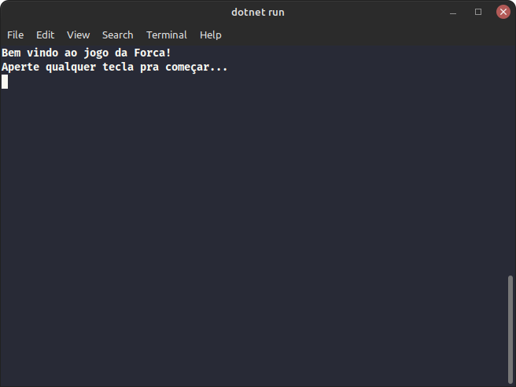
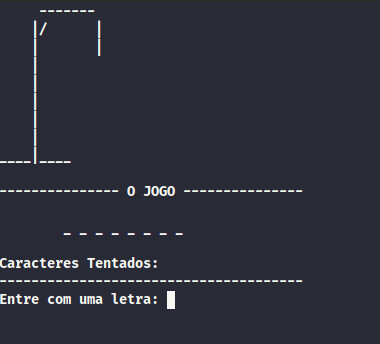
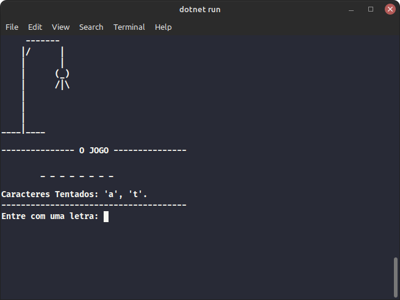
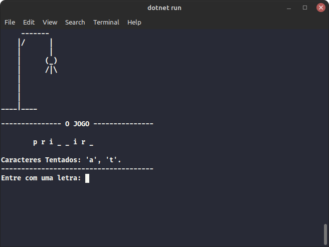

# Hangman Game

## Summary

- This is a simple hangman game, created using C# and Dotnet. In the future, i won't let the word visible. So, while the words are easy to find, try to find they without looking in the program files.

- The game is in portuguese, but i'll do some translation in future updates too. don't worry.

- Feel free to try it on your machine and contact me to show your games too :)

- Helpful Info: if you want to end the game without playing until the next word, just input the '#' character.

## How to use

First of all, you need the .Net 6.0 Runtime installed. You can download and install it in the [.Net website](https://dotnet.microsoft.com/en-us/).

Once you have the runtime installed, just clone the repository and navigate to the "/hangman_game" folder, then run the "dotnet run" command.

## Game's Rules and functionalities

- Words: I put 3 words in portuguese for now, but you can easily change they, just search for the variable ```listOfWords```, an array of strings.

- After you win the word, both the hangman and tried characters are reset.

- The hangman has 4 body parts, so you can guess a maximum of 4 wrong characters :p

## Game images








